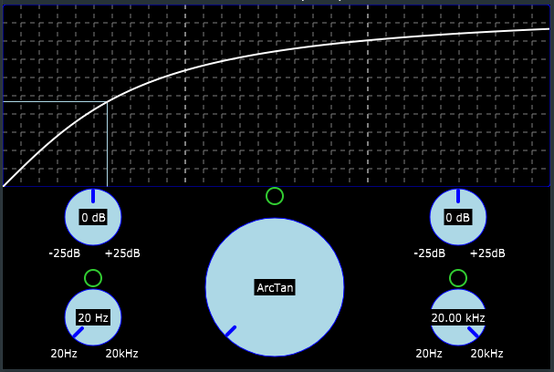
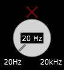
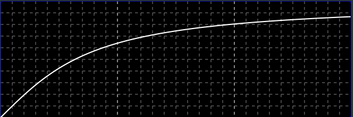
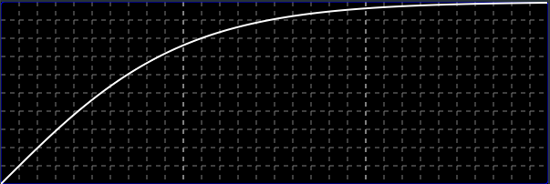
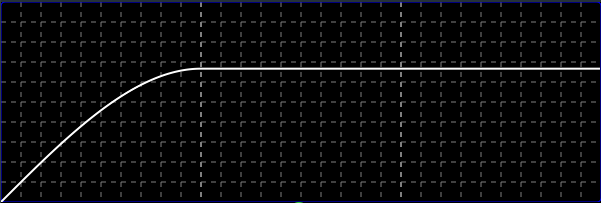
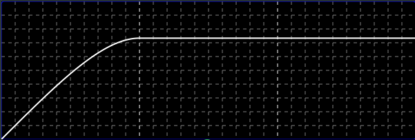
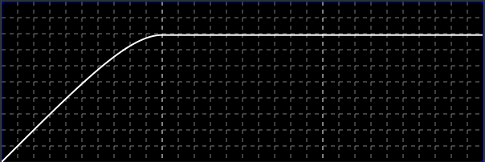
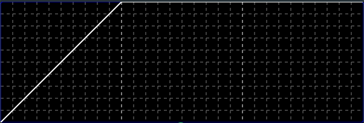

## testDistortion

A distortion VST plugin built in the JUCE framework, using the waveshaper module to achieve distortion. It has variable input and output gain, as well as a low-cut filter on the input and high-cut filter on the output for further tone-shaping options.

The graph plot shows the current transfer function being used, as well as the pre- and post-shaping volume levels for a visual indication of how much the signal is being clipped.

  

The distortion, low-cut and high-cut filters can be bypassed for A/B testing, with the corresponding control being greyed out when not in use:

  

The plugin includes 6 transfer functions for a variety of distortion flavours:
- Arctangent

  

$$ f \left( x \right) = atan \left(\pi x \over 2 \right) \times {2 \over \pi} $$

- Hyperpolic tangent

  

$$ f \left( x \right) = tanh \left( x \right) $$

- Cubic

  

$$ f \left( x \right) = \begin{cases}
  2 \over 3 & \quad x \geq 1 \\
  x - {x ^ 3 \over 3} & \quad -1 < x < 1 \\
  -2 \over 3 & \quad x \leq -1
  \end{cases}  $$

  - 5th power polynomial

  

$$ f \left( x \right) = \begin{cases}
  11 \over 15 & \quad x \geq 1 \\
  x - {x ^ 3 \over 6} - {x ^ 5 \over 10} & \quad -1 < x < 1 \\
  -11 \over 15 & \quad x \leq -1
  \end{cases}  $$

  - 7th power polynomial

  

$$ f \left( x \right) = \begin{cases}
  19 \over 24 & \quad x \geq 1 \\
  x - {x ^ 3 \over 12} - {x ^ 5 \over 16} - {x ^ 7 \over 16} & \quad -1 < x < 1 \\
  -19 \over 24 & \quad x \leq -1
  \end{cases}  $$

- Hard clipping

  

$$ f \left( x \right) = \begin{cases}
  1 & \quad x \geq 1 \\
  x & \quad -1 < x < 1 \\
  -1 & \quad x \leq -1
  \end{cases}  $$
